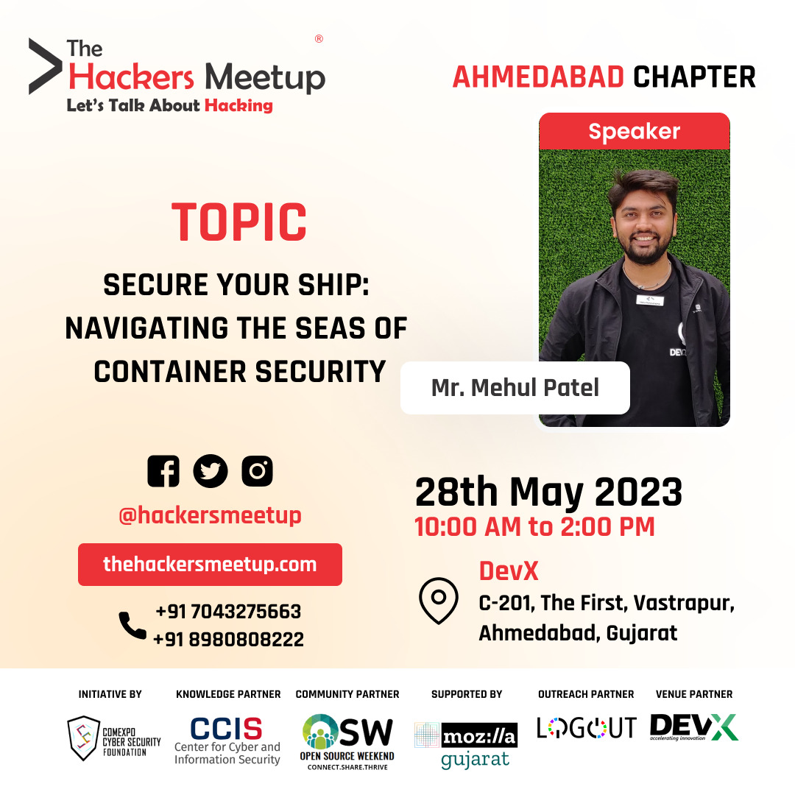

# THM-Ahmedabad-May-23
"The Hackers Meetup" Ahmedabad, Application Security special edition. 

### Talk Details 

* **Title**: Secure Your Ship: Navigating the Seas of Container Security
* **Talk Abstract**: Dive into the world of container security and learn how to protect your applications and data from potential threats. Discover best practices, tools, and techniques to ensure the integrity and confidentiality of your containerized environments. Don't let security concerns weigh you down—set sail with confidence in your containerized journey.
* 🗓️ Date: 28/05/2023
* ⏰ Time: 10.00 AM to 02.00 PM
* 📍 Venue: DevX, Vastrapur, Ahmedabad, Gujarat 380015.

#### Event Information 

Topics & Speakers as followed, Lets talk about #Hacking #HackTalk .
1. Mr. Prajit Sindhkar: Deep dive into http response manipulation 
2. Mr. Saurabh Patil : Web Application and Android Application Security
3. Mr. Nisarg Trivedi: Browser Plugins for Application Security Testing 
4. Mehul Patel : Secure your ship - Container Security 

## 🛡️ License

This project is licensed under the **MIT License** - see the [LICENSE](LICENSE) file for details.
